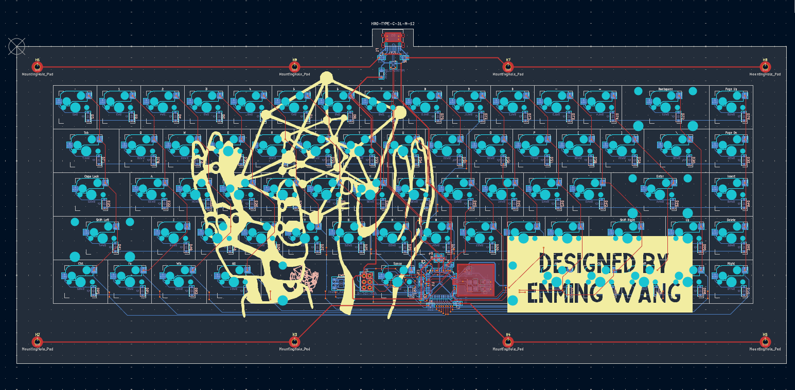

# My first Keyboard design

This 65% keyboard is the first time I designed a pcb of my own and safe to say that I am really proud of it. The reason that I started with a keyboard is that my first mechanical keyboard used the classic ANSI layout. While usable, an idea popped in my head: what if I make my own keyboard that has 4 keys to the left of the space bar just like the laptop keyboards, and here I am.  

---

# Project Overview

This project is a two-layer FR4 board with hot-swappable cherry MX keys realized with kalih's hot swap sockets. It features an on-board usb c 2.0 port with ESD. Its MCU is the ATMega32U4 and it features an AVR 6-pin ISP connector to program the MCU firmware. The board also has a reset button and copper-grounded mounting holes. 

This project is inspired by MasterZen's 65% keyboard tutorial. But there are major differences as I did not simply copy his design. First, his designed utilized soldered ALPS footprints that in my opinion has more space for the routing and therefore slightly easier to route. The kalih hot swap sockets caused a barrier that traces can't be wired through the sockets unlike the tutorial and that took some time to get used to. Since this is my first time doing this, I also have not mastered the art of routing so the vias are probably more than the same project done by someone more skilled. 

---

# Schematic

The following is the overall keyboard schematic, which doesn't deviate too much from the tutorial. Although it seems that power flags have changed from the older kicad version the tutorial was using to kicad 10. 

The ESD protection device that I have on here is the PRTR5V0U2X, a device suitable for doing ESD protection for USB 2.0 devices. This was chosen because of ease of use and that it has a small package size. 

The AVR 6-pin ISP pin is added to flash the initial usb bootloader for future firmware uploads, it also provides a backup to not fully rely on the usb port for firmware uploads as bad firmware could render it useless. 

The grounded mounting hole pads are there because initially my plan is to eventually make an aluminum enclosure for it and these copper mounting hole pads could help with grounding. But in the event of a plastic or resin enclosure, the board would still not be in danger because of its existing grounding and ESD protection. 

---

# PCB layout

My first layout finished with a lot of vias, a lot of which isn't really necessary on the hotswap pads themselves. But I would say that there are definitely more vias than I would like on the MCU pads and near the MCU. 

Regarding the grounding, my friend who does pcbs much more than me says that usually he fills both sides that have no traces with copper but Masterzen said that I don't need to cover both sides with copper as ground as that could amplify cross-talk. He mentioned that 4 layer boards and above have their dedicated ground layers so it wouldn't be an issue for them. 

---
