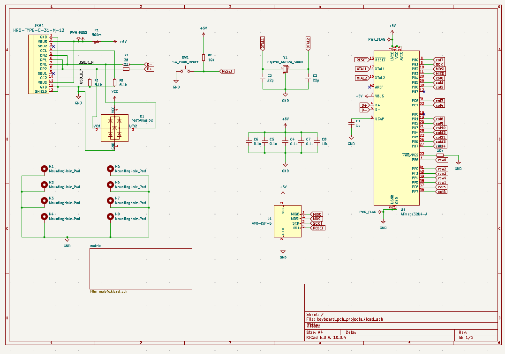

# My first Keyboard design

This 65% keyboard is the first time I designed a pcb of my own and safe to say that I am really proud of it. The reason that I started with a keyboard is that my first mechanical keyboard used the classic ANSI layout. While usable, an idea popped in my head: what if I make my own keyboard that has 4 keys to the left of the space bar just like the laptop keyboards, and here I am.  

---

# Project Overview

This project is a two-layer FR4 board with hot-swappable cherry MX keys realized with kalih's hot swap sockets. It features an on-board usb c 2.0 port with ESD. Its MCU is the ATMega32U4 and it features an AVR 6-pin ISP connector to program the MCU firmware. The board also has a reset button and copper-grounded mounting holes. 

This project is inspired by MasterZen's 65% keyboard tutorial. 

---

# Schematic

---
